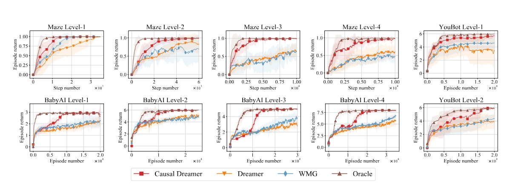

# CausalDreamer-POMBRL

Official implementation of the paper:

**Causal Dreamer for Partially Observable Model-Based Reinforcement Learning**  
(*Under Review*)  

## 🚀 Overview

This repository contains the code and experimental setup for our proposed **Causal Dreamer** framework, which improves model-based reinforcement learning (MBRL) in partially observable environments by integrating counterfactual inference for history compression and long-term reasoning.

Key contributions:

- A causality-based model that filters historical observations via **history counterfactual inference**.
- A **coarse-to-fine intervention strategy** that reduces computational overhead in causal mining.
- A variant of the Dreamer algorithm enhanced with causal memory selection, achieving superior performance in long-horizon, memory-dependent tasks.

## 📋 Paper

coming soon.  


## 🧠 Method Summary

We extend the Dreamer framework with a **causal gate** mechanism that filters out irrelevant history using a self-supervised auxiliary task based on counterfactual interventions. The resulting model improves the efficiency and accuracy of dynamics modeling and policy learning.

## 🛠️ Setup

### Requirements

Concrete dependencies include:
(We tested this setting in a newly created miniconda environment in Windows 10 and ubuntu 18.04)
-Python 3.6 (python 3.5+ should be ok but not tested)
-Numpy 1.17
-Pytorch 1.10.0


## 🧪 Running Experiments

### 🧪 Level-Based Maze Task

Run level 1:

```bash
python Code/main.py --level 1
```

Run level 2:

```bash
python Code/main.py --level 2
```


## 📊 Results

Below are the learning curves of **Causal Dreamer** and baseline methods across all sub-tasks:




## 🙏 Acknowledgements

This codebase builds on [DreamerV2](https://github.com/danijar/dreamerv2) and [BabyAI](https://github.com/mila-iqia/babyai).

```


